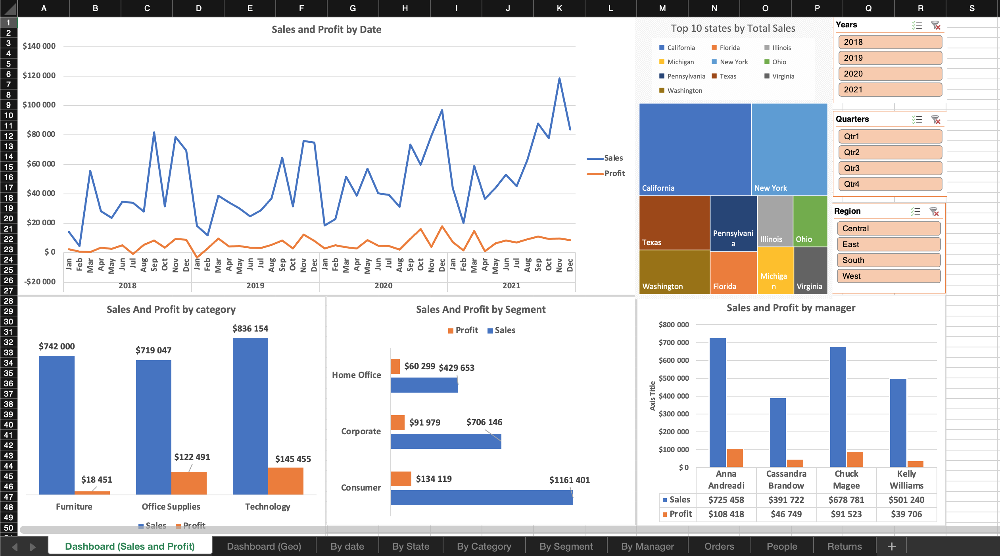

# Excel Projects

Here you'll find my **learning** projects on working with Excel for data analytics. Although few people use Excel for analytics nowadays, it is a good tool for understanding how to work with data, how to visualise and manipulate it. 

## Superstore

This project is made from dataset taken from Tableu. It consists of two files: 
* Sample - Superstore.xls (raw data)
* Superstore.xlsx (processed data with dashboards)

Actions performed:
* Insert columns from 2 and 3 table into 1 for data manipulation (using VLOOKUP)
* Data cleaning
* Pivot Tables
* Charts based on Pivot Tables

### Screenshots

### Things to do
More detailed metrics could be added in the future: 
* Average discount
* Average sales
* Profit rate
* Growth/decline dynamics of sales and income
* Number of returns
* Average bill per customer
---

## Coffee Shop

This project is made from dataset taken from Kaggle. It consists of two files: 
* Coffee Shop RAW.xlsx (raw data)
* Coffee Shop.xlsx (processed data with dashboards)

Actions performed:
* Insert some columns into one table for data manipulation (using VLOOKUP, Index and Match)
* Data cleaning (changed values with IF, deleted dublicates)
* Pivot Tables
* Charts based on Pivot Tables

### Screenshots

### Issues

Due to lack of customisation feauters in MacOS Excel, slicers and timeline have a small font and simple design.
