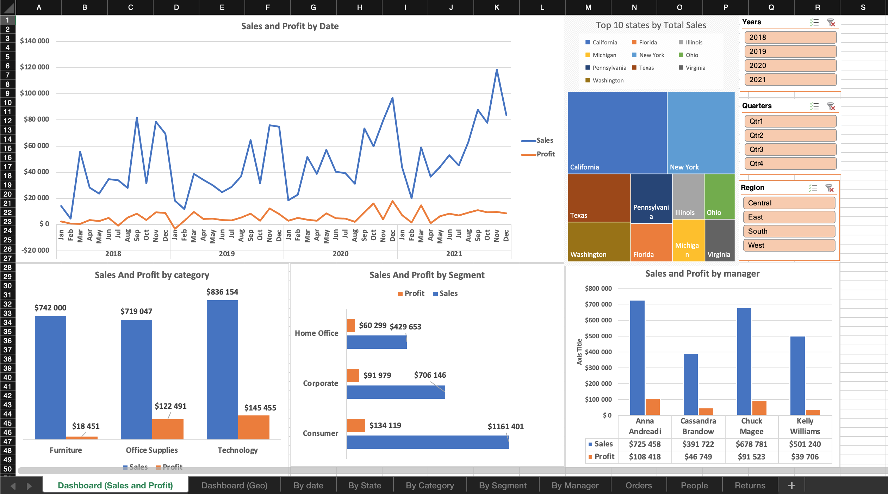

# Excel Projects

Here you'll find my projects on working with Excel for data analytics. Although few people use Excel for analytics nowadays, it is a good tool for understanding how to work with data, how to visualise and manipulate it. 

## Superstore

This project is made from data taken from Tableu. It consists of two files: 
* Sample - Superstore.xls (raw data)
* Superstore.xlsx (processed data with dashboards)

### Screenshots

### Things to do

1. Due to my map graph not working correctly, I had to make an ugly and not so informative graph. I'd better fix it (I'll try in the future). 

2. Also more detailed metrics could be added: 
    * Average discount
    * Average sales
    * Profit rate
    * Growth/decline dynamics of sales and income
    * Number of returns
    * Average bill per customer